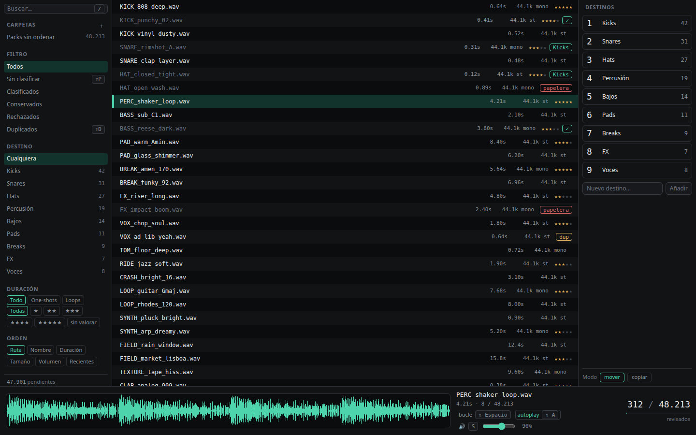
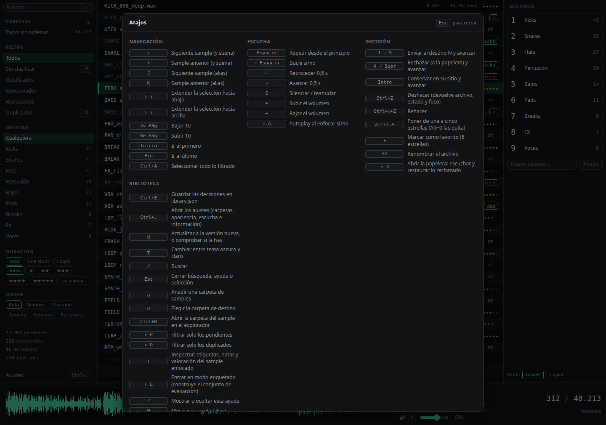

<div align="center">

# SampleCurator

**Miles de samples sin ordenar. Una tecla por decisión. Cero clics.**

[](https://github.com/AlexAlvarezAlmendros/SampleCurator/actions/workflows/ci.yml)
[](https://github.com/AlexAlvarezAlmendros/SampleCurator/releases/latest)
[](https://github.com/AlexAlvarezAlmendros/SampleCurator/releases/latest)
[](LICENSE)

[Descargar](https://github.com/AlexAlvarezAlmendros/SampleCurator/releases/latest) ·
[Cómo se usa](#usar) ·
[Por qué es rápido](#qué-lo-hace-rápido) ·
[Tus archivos, a salvo](#tus-archivos-a-salvo)



</div>

---

Tienes una carpeta con miles de sonidos descargados de packs, sin nombre coherente y sin
clasificar. Abrirlos uno a uno en el explorador para decidir cuáles vale la pena guardar es una
tarde entera y la abandonas a los diez minutos.

**SampleCurator los recorre por ti.** Bajas con la flecha, cada sample suena en el acto, y con
una tecla lo mandas a su carpeta (`1`…`9`), a la papelera (`X`) o lo dejas donde está (`Intro`).
Sin clics, sin modales, sin esperas. Y todo reversible con `Ctrl+Z`.

```
 ↓ / ↑     moverse (y escuchar al instante)      Espacio   repetir
 1 … 9     enviar al destino N  y avanzar        ⇧Espacio  bucle
 X         rechazar (papelera)  y avanzar        F2        renombrar
 Intro     conservar donde está y avanzar        /         buscar
 Ctrl+Z    deshacer                              ?         todos los atajos
```

## Qué lo hace rápido

| | |
|---|---|
| **2,6 ms** | de la tecla al sonido (p95, buffer de 256 frames) |
| **0,5 s** | escanear e indexar 50.000 archivos en frío |
| **16 ms** | cargar cualquier página de la lista, esté donde esté |
| **3 ms** | búsqueda incremental sobre 50.000 samples |
| **0** | clics necesarios en el bucle de triaje |

El motor de audio abre el dispositivo **una sola vez** al arrancar y mantiene en RAM los samples
vecinos al que estás mirando: cuando pulsas la flecha, el sonido ya está decodificado. Los
números salen de medir, no de suponer — ver [`docs/PERFORMANCE.md`](docs/PERFORMANCE.md).

## Tus archivos, a salvo

Esta app mueve y aparta archivos de tu librería personal, así que:

- **Nunca borra nada.** Los rechazados van a `<destino>/.samplecurator-trash/` con un manifiesto
  que guarda de dónde venía cada uno, y hay una vista para escucharlos y restaurarlos. Vaciar esa
  papelera es la única acción irreversible de la app, y la única que pide confirmación.
- **Cada operación se apunta antes de tocar el disco.** Si se corta la luz a mitad, al arrancar
  se detecta y se repara; ante la duda, siempre se conserva el original.
- **Nunca sobrescribe.** Tres `kick.wav` distintos al mismo destino acaban como `kick.wav`,
  `kick (2).wav` y `kick (3).wav`.
- **Entre discos, copia, verifica por hash y solo entonces borra el origen.**
- **`Ctrl+Z` lo deshace todo**, incluidos lotes de 40 samples y renombrados, y te devuelve el
  foco al sample afectado.
- **Tus etiquetas no tocan los archivos.** Valoración, notas y etiquetas viven en el índice; los
  `.wav` salen del proceso byte a byte como entraron.

## Instalar

Descarga el paquete de tu sistema de la
[última release](https://github.com/AlexAlvarezAlmendros/SampleCurator/releases/latest):

| Sistema | Archivo | Se actualiza sola |
|---|---|---|
| Linux (cualquiera) | `.AppImage` — `chmod +x` y ejecutar | Sí |
| Debian · Ubuntu | `.deb` | Avisa, y abre la descarga |
| Fedora · openSUSE | `.rpm` | Avisa, y abre la descarga |
| Windows 10/11 | `.exe` (instalador) o `.msi` | Sí |

**Se actualiza sola.** La app mira si hay versión nueva a los pocos segundos de arrancar y, si la
hay, lo dice en un rincón de la barra lateral. Con `U` la descarga, la instala y se reinicia. Los
paquetes van firmados y verifica la firma antes de instalar nada. Nunca actualiza sin que se lo
pidas.

Los `.exe` y `.msi` no llevan certificado de Windows: SmartScreen mostrará el aviso.
«Más información» → «Ejecutar de todas formas».

<details>
<summary>Construirlo tú</summary>

```bash
# Linux (Ubuntu 24.04)
sudo apt install -y libwebkit2gtk-4.1-dev libgtk-3-dev libayatana-appindicator3-dev \
                    librsvg2-dev libasound2-dev build-essential curl file pkg-config
curl --proto '=https' --tlsv1.2 -sSf https://sh.rustup.rs | sh

pnpm install
pnpm tauri build     # → src-tauri/target/release/bundle/{deb,rpm,appimage}/
```

```powershell
# Windows: Rust (rustup.rs), Node 22, pnpm 9 y las Build Tools de Visual Studio
# con la carga de trabajo «Desarrollo para el escritorio con C++».
pnpm install
pnpm tauri build     # → src-tauri\target\release\bundle\{msi,nsis}\
```

> **Estado de Windows:** el CI compila, pasa clippy, ejecuta los tests del núcleo en
> `windows-latest` y construye los dos instaladores. Lo que **no** está verificado es la
> ejecución real: nadie ha abierto todavía la app en Windows. La diferencia conocida es el audio:
> WASAPI no deja fijar el tamaño de buffer, así que allí manda el del sistema (~10 ms frente a
> los 2,6 ms medidos en Linux). Sigue siendo cómodamente imperceptible.

</details>

## Usar

1. **`O`** — elige la carpeta con tus samples. La lista aparece en un segundo o dos; las
   duraciones y las ondas van llegando solas mientras ya estás triando.
2. **`D`** — elige la carpeta donde quieres construir tu librería ordenada.
3. **Escribe los destinos** (Kicks, Snares, FX…). Se les asigna la tecla `1`…`9` por orden, y si
   la carpeta de destino ya tiene subcarpetas, se te ofrecen directamente.
4. **`↓` y a triar.**

Modo **mover** (por defecto) o **copiar**, por sesión. En modo copiar tu carpeta de origen no se
toca nunca, ni siquiera al rechazar.

Pulsa **`?`** en cualquier momento para ver el mapa de teclas completo:



### Más allá del triaje

- **Filtros** por estado (sin clasificar, conservados, rechazados), destino, valoración,
  duración (one-shots o loops) y duplicados detectados por hash de contenido.
- **Valoración con estrellas** (`Alt+1`…`Alt+5`), **notas** y **etiquetas** por sample.
- **Renombrar** en la propia barra de transporte, sin diálogos (`F2`).
- **Papelera con vista propia** (`⇧X`): escucha lo rechazado antes de decidir, y restaura.
- **Exportar** tus decisiones a `library.json` (`Ctrl+E`).

## Desarrollo

```bash
pnpm tauri dev                                            # app con recarga en caliente
pnpm typecheck && pnpm biome check . && pnpm vitest run   # frontend
cargo clippy --manifest-path src-tauri/Cargo.toml --all-targets -- -D warnings
cargo test --manifest-path src-tauri/Cargo.toml           # núcleo Rust
```

- Arquitectura → [`docs/ARCHITECTURE.md`](docs/ARCHITECTURE.md)
- Sistema de diseño → [`docs/DESIGN_SYSTEM.md`](docs/DESIGN_SYSTEM.md)
- Flujo de triaje y atajos → [`docs/UX_TRIAGE.md`](docs/UX_TRIAGE.md)
- Modelo de datos → [`docs/DATA_MODEL.md`](docs/DATA_MODEL.md)
- Rendimiento medido → [`docs/PERFORMANCE.md`](docs/PERFORMANCE.md)
- Decisiones técnicas → [`docs/adr/`](docs/adr/)
- Plan de trabajo → [`docs/planning/ROADMAP.md`](docs/planning/ROADMAP.md)

## Stack

**Tauri 2** (Rust) · **React 19** + TypeScript · **SQLite** · **`cpal`** + **`symphonia`** para
audio nativo. El núcleo hace todo el trabajo pesado; el WebView solo pinta.

El callback de audio corre en un hilo de tiempo real donde no se reserva memoria, no se bloquea y
no se hace I/O: los buffers llegan decodificados desde el hilo de control por un ring buffer sin
locks. Esa disciplina es la razón de los 2,6 ms.

## Publicar una versión

```bash
scripts/publicar.sh 0.3.0
```

Sube el número en los tres sitios donde vive (`package.json`, `tauri.conf.json`, `Cargo.toml`),
comitea, etiqueta y empuja.

El workflow `release.yml` compila Linux y Windows, firma los paquetes con la clave del
actualizador, publica la release con los binarios y sube el `latest.json` que las apps ya
instaladas consultan. La clave privada vive en los secretos del repositorio; **si se pierde, las
apps instaladas dejarán de aceptar actualizaciones** (la clave pública va compilada dentro).

## Licencia

MIT — ver [LICENSE](LICENSE).
